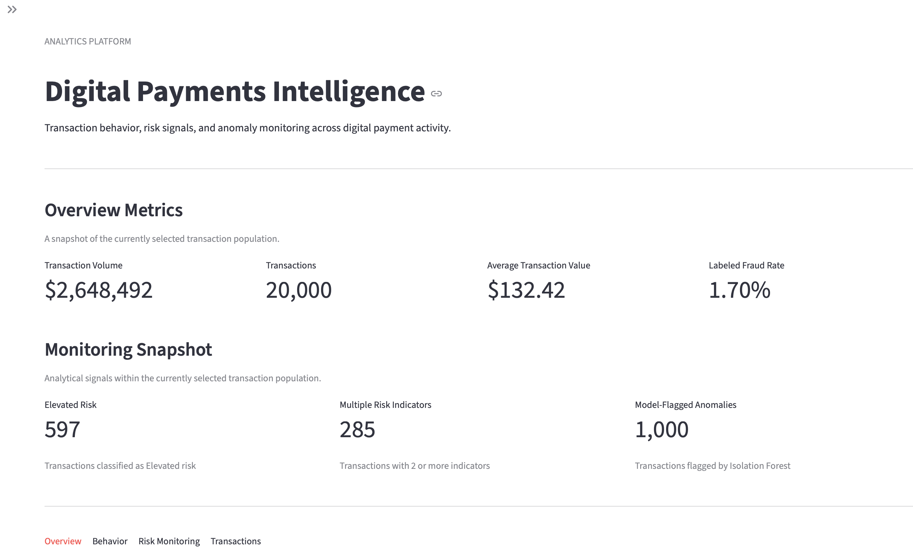
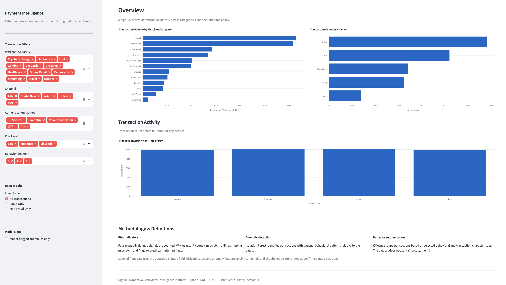
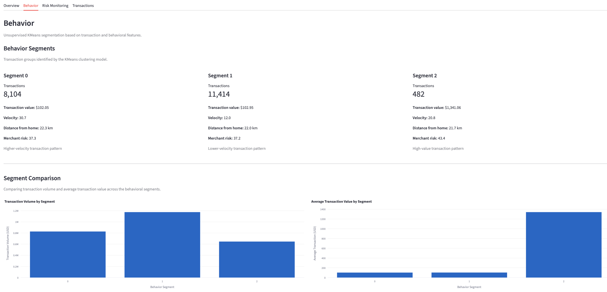
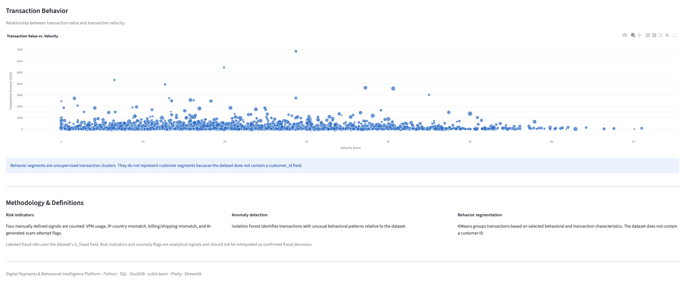
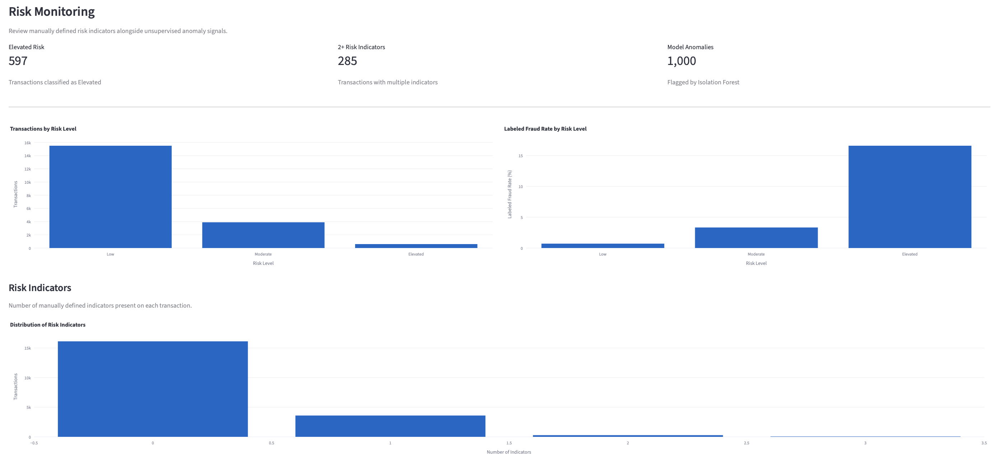
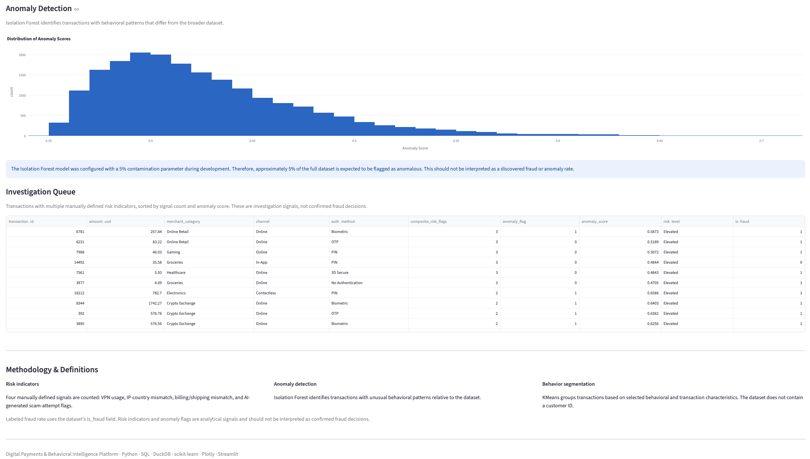

# Digital Payments & Behavioral Intelligence Platform

An end-to-end analytics platform for exploring digital payment behavior, identifying unusual transaction patterns, and surfacing risk signals using **Python, SQL, machine learning, and interactive data visualization**.

---

## Project Overview

Digital payment systems generate large volumes of transaction data that can be analyzed to understand transaction behavior, monitor risk indicators, and identify unusual activity.

This project transforms a synthetic credit card transaction dataset into an interactive analytics platform. The workflow combines **data preparation, SQL analytics, behavioral segmentation, anomaly detection, and interactive visualization**.

The goal is to demonstrate how analytical and machine learning techniques can be combined to turn raw transaction data into structured insights and an interactive monitoring experience.

---

## What I Built

I built an interactive digital payments analytics platform to explore transaction behavior, identify unusual activity, and surface risk signals.

The project combines:

* **SQL and DuckDB** for analytical queries
* **KMeans** for unsupervised behavioral segmentation
* **Isolation Forest** for anomaly detection
* **Python and pandas** for data preparation and analysis
* **Plotly and Streamlit** for interactive visualization and dashboard development

---

## Key Questions

The analysis focuses on the following questions:

1. Which merchant categories and payment channels generate the most transaction activity and transaction volume?
2. What behavioral patterns can be identified across transactions?
3. Which transactions contain multiple manually defined risk indicators?
4. How can anomaly detection surface transactions with unusual behavioral patterns?
5. How do transaction characteristics vary across behavioral segments?
6. How can SQL, machine learning, and interactive dashboards support transaction monitoring?

---

## Dataset

This project uses the **Credit Card Fraud Detection 2026** dataset by **Udit Jain**.

* **Source:** Kaggle
* **Author:** Udit Jain
* **License:** CC0: Public Domain
* **Transactions:** 20,000
* **Original features:** 26

The dataset contains transaction, payment, behavioral, account, and risk-related attributes.

### Key Features

* Transaction amount
* Merchant category
* Card type
* Authentication method
* Payment channel
* Device type
* Foreign transaction indicator
* Hours since previous transaction
* Transaction count in the previous 24 hours
* Distance from home
* Card age
* Customer age
* Account balance
* New merchant indicator
* VPN usage
* IP-country mismatch
* Billing/shipping mismatch
* CVV retry count
* Velocity score
* Time of day
* Day of week
* AI-generated scam-attempt indicator
* Merchant risk score
* Prior disputes
* Fraud label

### Dataset Consideration

The dataset does **not** contain a `customer_id` field. Therefore, the behavioral segmentation in this project is performed at the **transaction level** rather than being presented as customer segmentation.

The dataset also does not contain a transaction date field, so the project focuses on time-of-day and day-of-week patterns rather than longitudinal time-series analysis.

---

## Methodology

### 1. Data Preparation

The raw transaction data was processed using Python and pandas.

The preprocessing workflow included:

* Standardizing the dataset structure
* Checking transaction IDs for duplicates
* Converting numeric fields to appropriate data types
* Handling missing numeric values using median imputation
* Creating derived behavioral and risk features

### Engineered Features

The project creates additional features including:

* `amount_vs_global_avg`
* `amount_to_balance_ratio`
* `composite_risk_flags`
* `high_velocity_flag`
* `unusual_distance_flag`
* `time_of_day_period`

The `composite_risk_flags` feature counts four manually defined indicators:

1. VPN usage
2. IP-country mismatch
3. Billing/shipping mismatch
4. AI-generated scam-attempt indicator

The processed dataset is stored as a Parquet file for analytical querying and dashboard use.

---

### 2. SQL Analytics

**DuckDB** is used to query the processed Parquet dataset directly with SQL.

The analytical queries examine:

* Overall transaction volume
* Average and median transaction value
* Merchant category activity
* Payment channel activity
* Authentication methods
* Time-of-day activity
* Risk indicator distribution
* Risk-level distribution
* Behavioral segment characteristics
* High-value transactions
* Merchant transaction volume
* Channel-level fraud labels
* Transactions containing multiple risk indicators

This provides a SQL-based analytical layer alongside the Python workflow.

---

### 3. Behavioral Segmentation

**KMeans clustering** is used to identify groups of transactions with similar behavioral characteristics.

The clustering model uses features including:

* Transaction amount
* Time since previous transaction
* Transaction velocity
* Transaction frequency
* Distance from home
* Account balance
* CVV retry count
* Merchant risk score
* Prior disputes
* Amount relative to the global average
* Amount relative to account balance
* Composite risk indicators

Three transaction-level behavioral segments were identified.

| Segment   | Transactions | Transaction Volume | Avg. Transaction | Avg. Velocity | Avg. Distance | Avg. Merchant Risk |
| --------- | -----------: | -----------------: | ---------------: | ------------: | ------------: | -----------------: |
| Segment 0 |        8,104 |        $826,994.61 |          $102.05 |         30.68 |      22.34 km |              37.35 |
| Segment 1 |       11,414 |      $1,175,106.94 |          $102.95 |         12.05 |      22.01 km |              37.18 |
| Segment 2 |          482 |        $646,390.39 |        $1,341.06 |         20.79 |      21.72 km |              43.45 |

The segments are interpreted based on their observed characteristics rather than being assigned predetermined labels.

For example:

* **Segment 0** shows a higher-velocity transaction pattern.
* **Segment 1** shows a lower-velocity transaction pattern.
* **Segment 2** represents a relatively small, high-value transaction pattern.

These are transaction behavior groups, not customer profiles.

---

### 4. Anomaly Detection

An **Isolation Forest** model is used to identify transactions with behavioral patterns that differ from the broader dataset.

The model generates:

* `anomaly_prediction`
* `anomaly_flag`
* `anomaly_score`

The model was configured with a **5% contamination parameter**, resulting in approximately **1,000 model-flagged anomalies** in the full 20,000-transaction dataset.

The 5% figure is a model configuration and should **not** be interpreted as a discovered anomaly or fraud rate.

The anomaly score is used as an analytical signal alongside transaction characteristics and manually defined risk indicators.

---

### 5. Risk Signal Framework

Four manually defined indicators are combined into a `composite_risk_flags` measure:

* VPN usage
* IP-country mismatch
* Billing/shipping mismatch
* AI-generated scam-attempt indicator

Across the full dataset:

| Risk Indicators | Transactions |  Share |
| --------------: | -----------: | -----: |
|               0 |       16,118 | 80.59% |
|               1 |        3,597 | 17.99% |
|               2 |          279 |  1.40% |
|               3 |            6 |  0.03% |

A total of **285 transactions**, approximately **1.43% of the dataset**, contained two or more manually defined risk indicators.

These indicators are analytical signals rather than confirmed fraud decisions.

---

## Key Findings

### Overall Transaction Activity

The dataset contains:

* **20,000 transactions**
* **$2,648,491.94** total transaction volume
* **$132.42** average transaction value
* **$57.51** median transaction value
* Minimum transaction value: **$1.00**
* Maximum transaction value: **$6,872.69**

The difference between the mean and median transaction values reflects the presence of higher-value transactions within the dataset.

---

### Merchant Categories

Transaction activity varies substantially across merchant categories.

The highest transaction volumes in the dataset were observed in:

| Merchant Category | Transactions | Transaction Volume | Avg. Transaction |
| ----------------- | -----------: | -----------------: | ---------------: |
| Travel            |        1,420 |        $628,217.75 |          $442.41 |
| Electronics       |        2,032 |        $613,888.07 |          $302.11 |
| Online Retail     |        3,416 |        $283,801.03 |           $83.08 |
| Groceries         |        3,242 |        $266,595.96 |           $82.23 |
| Crypto Exchange   |          561 |        $200,373.44 |          $357.17 |

Travel had the largest transaction volume in the dataset, while Streaming had the smallest transaction volume.

---

### Payment Channels

The dataset contains five payment channels:

* Online
* POS
* Contactless
* In-App
* ATM

Online transactions represented the largest transaction count with **6,810 transactions**, followed by POS with **5,191 transactions**.

Average transaction values varied across the channels, ranging from approximately **$125 to $138**.

---

### Authentication Methods

The dataset includes:

* 3D Secure
* OTP
* PIN
* Biometric
* No Authentication

3D Secure represented the largest transaction count among the authentication methods with **5,554 transactions**, followed by OTP with **4,792 transactions**.

The dataset's `is_fraud` label is used for descriptive comparison and should not be interpreted as a causal assessment of authentication effectiveness.

---

### Risk Levels

The project creates analytical risk levels using risk-related signals.

Across the full dataset:

| Risk Level | Transactions | Labeled Fraud Count | Labeled Fraud Rate |
| ---------- | -----------: | ------------------: | -----------------: |
| Low        |       15,501 |                 110 |              0.71% |
| Moderate   |        3,902 |                 130 |              3.33% |
| Elevated   |          597 |                  99 |             16.58% |

The `is_fraud` column is the fraud label supplied by the dataset.

The labeled fraud rate is presented descriptively to examine how the existing dataset labels are distributed across the analytical risk levels. It does not mean that the risk-level framework independently detects or proves fraud.

---

### Behavioral Segmentation

The KMeans model identified three transaction-level behavioral patterns.

**Segment 0**

* 8,104 transactions
* Average transaction: $102.05
* Average velocity: 30.68
* Average merchant risk: 37.35

This segment shows a relatively higher transaction velocity pattern.

**Segment 1**

* 11,414 transactions
* Average transaction: $102.95
* Average velocity: 12.05
* Average merchant risk: 37.18

This segment shows a relatively lower transaction velocity pattern.

**Segment 2**

* 482 transactions
* Average transaction: $1,341.06
* Average velocity: 20.79
* Average merchant risk: 43.45

This is a relatively small segment characterized primarily by substantially higher transaction values.

---

## Dashboard

The project includes an interactive **Streamlit dashboard** designed to provide an analytical view of transaction activity and risk signals.

### Overview

The Overview tab provides:

* Transaction volume
* Transaction count
* Average transaction value
* Labeled fraud rate
* Transaction volume by merchant category
* Transaction count by payment channel
* Transaction activity by time of day

---

### Behavior

The Behavior tab explores:

* KMeans behavioral segments
* Segment characteristics
* Transaction volume by segment
* Average transaction value by segment
* Transaction value vs. transaction velocity

The dashboard explicitly treats these as **transaction behavioral segments**, since the dataset does not contain a customer identifier.

---

### Risk Monitoring

The Risk Monitoring tab provides:

* Transactions by risk level
* Labeled fraud rate by risk level
* Distribution of manually defined risk indicators
* Anomaly score distribution
* Model-flagged anomaly count
* Investigation queue

The Investigation Queue surfaces transactions containing multiple manually defined risk indicators and orders them using the available analytical signals.

These records are **investigation signals, not confirmed fraud decisions**.

---

### Transactions

The Transactions tab provides transaction-level exploration.

Users can:

* Filter by transaction amount
* Filter by number of risk indicators
* Inspect transaction attributes
* Review behavioral segments
* Review anomaly signals
* Review risk levels
* Compare against the dataset's fraud label
* Download filtered transactions as CSV

---

## Dashboard Preview

### Overview





### Behavioral Segmentation





### Risk Monitoring





---

## Technical Stack

| Area                    | Technology       |
| ----------------------- | ---------------- |
| Programming             | Python           |
| Data Processing         | pandas, NumPy    |
| SQL Analytics           | DuckDB           |
| Machine Learning        | scikit-learn     |
| Behavioral Segmentation | KMeans           |
| Anomaly Detection       | Isolation Forest |
| Visualization           | Plotly           |
| Dashboard               | Streamlit        |
| Data Storage            | Parquet          |
| Model Serialization     | joblib           |
| Development             | VS Code          |

---

## Project Structure

```text
digital-payments-behavioral-intelligence/
│
├── app/
│   └── streamlit_app.py
│
├── data/
│   ├── credit_card_fraud_2026.csv
│   └── processed_transactions.parquet
│
├── models/
│   ├── kmeans_clusterer.pkl
│   ├── scaler.pkl
│   ├── isolation_forest.pkl
│   └── anomaly_scaler.pkl
│
├── sql/
│   └── analytics.sql
│
├── .gitignore
├── requirements.txt
├── run_sql.py
└── README.md
```

---

## How to Run

### 1. Clone the repository

```bash
git clone https://github.com/havenyj/digital-payments-behavioral-intelligence.git
cd digital-payments-behavioral-intelligence
```

### 2. Create a virtual environment

macOS / Linux:

```bash
python3 -m venv .venv
```

Windows:

```bash
python -m venv .venv
```

### 3. Activate the virtual environment

macOS / Linux:

```bash
source .venv/bin/activate
```

Windows:

```bash
.venv\Scripts\activate
```

### 4. Install dependencies

```bash
pip install -r requirements.txt
```

### 5. Run the SQL analysis

```bash
python run_sql.py
```

### 6. Launch the dashboard

```bash
streamlit run app/streamlit_app.py
```

The Streamlit application will open in your browser.

---

## Analytical Workflow

```text
                  Raw Transaction Dataset
                           │
                           ▼
                 Data Cleaning & Validation
                           │
                           ▼
                    Feature Engineering
                           │
                           ▼
                  Processed Parquet Data
                           │
             ┌─────────────┼─────────────┐
             │             │             │
             ▼             ▼             ▼
        SQL Analytics   KMeans      Isolation Forest
             │             │             │
             ▼             ▼             ▼
        Analytical     Behavioral     Anomaly
         Queries        Segments       Signals
             │             │             │
             └─────────────┼─────────────┘
                           │
                           ▼
                  Streamlit Dashboard
                           │
                           ▼
                Transaction Monitoring
```

---

## Skills Demonstrated

This project demonstrates practical experience with:

* Data cleaning and preprocessing
* Exploratory data analysis
* Feature engineering
* SQL analytics
* DuckDB
* Python and pandas
* Unsupervised machine learning
* KMeans clustering
* Anomaly detection
* Isolation Forest
* Interactive data visualization
* Plotly
* Streamlit
* Dashboard development
* Transaction-level risk analysis
* Analytical storytelling
* Translating analytical results into an interactive application

---

## Limitations

This project is intended as an analytics and machine learning portfolio project rather than a production fraud detection system.

Key limitations include:

* The dataset does not contain a `customer_id`, so segmentation is performed at the transaction level.
* The dataset does not contain a transaction date, limiting longitudinal and time-series analysis.
* The fraud label is provided by the dataset rather than generated by this project.
* The manually defined risk indicators have not been validated as production fraud rules.
* Isolation Forest identifies unusual statistical patterns but does not determine whether a transaction is fraudulent.
* The 5% Isolation Forest contamination setting is a model configuration and should not be interpreted as the actual prevalence of anomalies.
* The dataset is synthetic and should not be assumed to represent the behavior of real-world payment systems.
* A production implementation would require additional model validation, monitoring, explainability, threshold calibration, security controls, and domain-specific fraud expertise.

---

## Future Improvements

Potential extensions include:

* Introduce a customer identifier for genuine customer-level behavioral analysis
* Add transaction timestamps for longitudinal analysis
* Evaluate anomaly detection results against labeled outcomes
* Compare multiple anomaly detection algorithms
* Add supervised fraud classification
* Evaluate model performance using precision, recall, F1-score, and confusion matrices
* Add model explainability
* Introduce configurable investigation thresholds
* Add automated data refresh pipelines
* Add database integration
* Deploy the Streamlit dashboard
* Implement monitoring for model drift and data quality

---

## Dataset Attribution

**Credit Card Fraud Detection 2026**
Created by **Udit Jain**
Source: Kaggle
License: **CC0: Public Domain**

The dataset is used for educational and portfolio analysis.

---

## Disclaimer

This project is for educational and portfolio purposes only.

The behavioral segments, risk indicators, anomaly scores, and analytical risk levels are model outputs or analytical signals. They should not be treated as standalone evidence of fraudulent activity or used as automated decisions for real-world financial transactions.

---

## Author

**L林月君 (Ei Thinzar Myo)**

Computer Science (Big Data) Graduate
Data Analytics · SQL · Python · Data Visualization · Machine Learning

[GitHub](https://github.com/havenyj) · [LinkedIn](https://www.linkedin.com/in/eithinzarmyo/)
